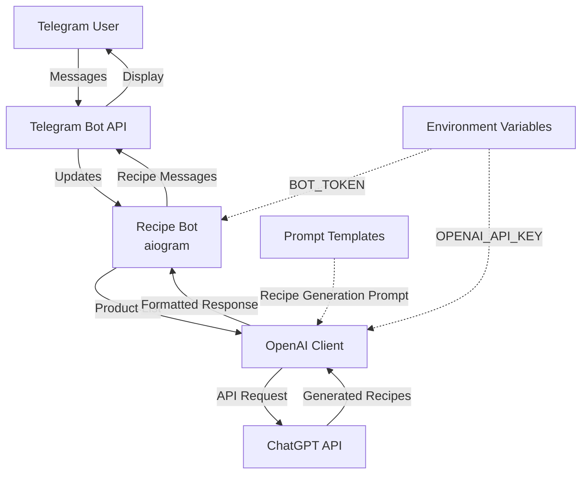
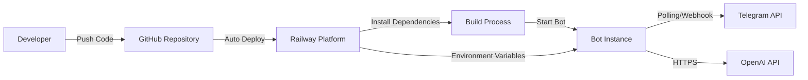
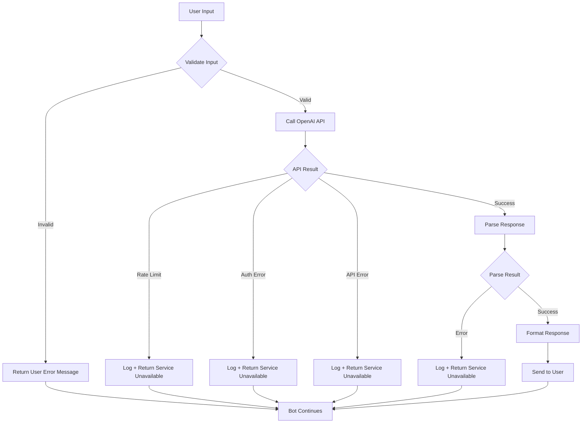

# Technical Design Document

## Overview

Telegram Recipe Bot — это асинхронный Telegram-бот, который генерирует персонализированные рецепты на основе списка продуктов пользователя. Система интегрируется с OpenAI ChatGPT API для генерации рецептов и развертывается на Railway Platform для обеспечения непрерывной работы.

⚠️ **КРИТИЧЕСКИ ВАЖНО: Проект разворачивается ТОЛЬКО на Railway Platform. Локальная установка и запуск ЗАПРЕЩЕНЫ.**

### Core Functionality

Бот принимает текстовые сообщения с перечислением продуктов и возвращает два рецепта:
- Рецепт №1: использует только указанные продукты
- Рецепт №2: может включать дополнительные ингредиенты

### Technology Stack

- **Runtime**: Python 3.11+
- **Bot Framework**: aiogram 3.x (асинхронная библиотека для Telegram Bot API)
- **AI Integration**: openai library (официальный клиент OpenAI API)
- **Configuration**: python-dotenv (управление переменными окружения)
- **Deployment**: Railway Platform с поддержкой webhook через FastAPI/uvicorn

## Architecture

### System Architecture



### Data Flow

1. **User Input**: Пользователь отправляет команду /start или текстовое сообщение со списком продуктов
2. **Input Validation**: Бот валидирует входные данные (длина, пустые значения)
3. **Prompt Construction**: Система формирует промпт для ChatGPT с использованием шаблонов
4. **API Request**: OpenAI Client отправляет запрос к ChatGPT API
5. **Response Processing**: Полученный ответ парсится и форматируется
6. **User Response**: Отформатированные рецепты отправляются пользователю через Telegram

### Deployment Architecture

⚠️ **ВАЖНО: Локальная установка ЗАПРЕЩЕНА. Весь процесс развертывания происходит только на Railway Platform.**



**Deployment Flow:**
1. Разработчик пушит код в GitHub репозиторий
2. Railway автоматически обнаруживает изменения
3. Railway устанавливает зависимости из requirements.txt
4. Railway запускает бота через Procfile
5. Бот начинает работу на Railway инфраструктуре

## Components and Interfaces

### 1. Bot Module (bot.py)

**Responsibility**: Основная логика бота, обработка команд и сообщений пользователей

**Key Functions**:
- `start_handler(message: Message)`: Обработчик команды /start
- `message_handler(message: Message)`: Обработчик текстовых сообщений с продуктами
- `validate_product_list(text: str) -> tuple[bool, str]`: Валидация списка продуктов
- `format_recipe_response(recipes: dict) -> str`: Форматирование ответа с рецептами
- `main()`: Точка входа приложения

**Dependencies**:
- aiogram.Bot, aiogram.Dispatcher
- openai_client.OpenAIClient
- prompts module

**Error Handling**:
- Обработка пустых сообщений
- Обработка сообщений длиннее 300 символов
- Обработка ошибок API (делегирование в OpenAIClient)

### 2. OpenAI Client Module (openai_client.py)

**Responsibility**: Интеграция с OpenAI ChatGPT API

**Class**: `OpenAIClient`

**Methods**:
```python
class OpenAIClient:
    def __init__(self, api_key: str):
        """Инициализация клиента с API ключом"""
        
    async def generate_recipes(self, product_list: str) -> dict:
        """
        Генерирует 2 рецепта на основе списка продуктов
        
        Args:
            product_list: Строка с перечислением продуктов
            
        Returns:
            dict: {
                "recipe1": {
                    "title": str,
                    "ingredients": list[str],
                    "steps": list[str],
                    "cooking_time": str
                },
                "recipe2": {...}
            }
            
        Raises:
            OpenAIAPIError: При ошибках API
            RateLimitError: При превышении лимитов
            AuthenticationError: При проблемах с аутентификацией
        """
```

**Error Handling**:
- `openai.APIError` → OpenAIAPIError
- `openai.RateLimitError` → RateLimitError  
- `openai.AuthenticationError` → AuthenticationError
- Все ошибки логируются и пробрасываются для обработки в bot.py

**API Configuration**:
- Model: `gpt-3.5-turbo` (оптимальный баланс скорости и качества)
- Temperature: 0.7 (креативность в генерации рецептов)
- Max tokens: 1500 (достаточно для 2 детальных рецептов)

### 3. Prompts Module (prompts.py)

**Responsibility**: Хранение и управление шаблонами промптов

**Constants**:
```python
RECIPE_GENERATION_PROMPT = """
Ты - профессиональный шеф-повар. На основе списка продуктов предложи 2 рецепта:

Продукты: {product_list}

Требования:
1. Рецепт №1: используй ТОЛЬКО продукты из списка
2. Рецепт №2: можешь добавить дополнительные ингредиенты

Для каждого рецепта укажи:
- Название блюда
- Ингредиенты (с количеством)
- Пошаговое приготовление
- Время приготовления

Формат ответа должен быть структурированным и легко читаемым.
"""

WELCOME_MESSAGE = """
Привет! 👨‍🍳 Напиши список продуктов, которые есть у тебя в холодильнике.

Например: курица, картошка, сыр, помидоры
"""

ERROR_MESSAGES = {
    "empty_list": "Пожалуйста отправьте список продуктов.",
    "too_long": "Список продуктов слишком длинный. Пожалуйста, сократите до 300 символов.",
    "service_unavailable": "Сервис рецептов временно недоступен. Попробуйте позже."
}
```

### 4. Configuration Module (config.py)

**Responsibility**: Управление конфигурацией и переменными окружения

**Functions**:
```python
def load_config() -> dict:
    """
    Загружает конфигурацию из переменных окружения
    
    Returns:
        dict: {
            "bot_token": str,
            "openai_api_key": str
        }
        
    Raises:
        ConfigurationError: Если обязательные переменные не установлены
    """
```

**Environment Variables**:
- `BOT_TOKEN`: Токен Telegram бота (обязательный) - настраивается в Railway Dashboard
- `OPENAI_API_KEY`: Ключ OpenAI API (обязательный) - настраивается в Railway Dashboard
- `WEBHOOK_URL`: URL для webhook режима (опциональный) - автоматически предоставляется Railway
- `PORT`: Порт для webhook сервера (опциональный, default: 8000) - автоматически назначается Railway

⚠️ **Все переменные окружения настраиваются только в Railway Dashboard, не локально.**

### 5. Response Formatter

**Responsibility**: Форматирование ответов для Telegram с использованием Markdown

**Function**:
```python
def format_recipe_response(recipes: dict) -> str:
    """
    Форматирует рецепты в Telegram Markdown
    
    Returns:
        str: Отформатированное сообщение с двумя рецептами
    """
```

**Markdown Format**:
```
🍳 *Рецепт №1 (только из указанных продуктов)*

*Название:* [название]

*Ингредиенты:*
• [ингредиент 1]
• [ингредиент 2]

*Приготовление:*
1. [шаг 1]
2. [шаг 2]

⏱ *Время:* [время]

---

🍽 *Рецепт №2 (с дополнительными ингредиентами)*

[аналогичный формат]
```

## Data Models

### Message Flow Models

**UserMessage**:
```python
@dataclass
class UserMessage:
    user_id: int
    text: str
    timestamp: datetime
```

**RecipeRequest**:
```python
@dataclass
class RecipeRequest:
    product_list: str
    user_id: int
    
    def validate(self) -> tuple[bool, str]:
        """Валидация запроса"""
        if not self.product_list or self.product_list.isspace():
            return False, "empty_list"
        if len(self.product_list) > 300:
            return False, "too_long"
        return True, ""
```

**Recipe**:
```python
@dataclass
class Recipe:
    title: str
    ingredients: list[str]
    steps: list[str]
    cooking_time: str
    recipe_type: Literal["only_listed", "with_additional"]
```

**RecipeResponse**:
```python
@dataclass
class RecipeResponse:
    recipe1: Recipe  # только из указанных продуктов
    recipe2: Recipe  # с дополнительными ингредиентами
    
    def to_telegram_message(self) -> str:
        """Конвертация в Telegram Markdown формат"""
```

### Error Models

```python
class BotError(Exception):
    """Базовый класс для ошибок бота"""
    pass

class ValidationError(BotError):
    """Ошибки валидации пользовательского ввода"""
    pass

class OpenAIAPIError(BotError):
    """Ошибки взаимодействия с OpenAI API"""
    pass

class RateLimitError(OpenAIAPIError):
    """Превышение лимитов API"""
    pass

class AuthenticationError(OpenAIAPIError):
    """Ошибки аутентификации API"""
    pass

class ConfigurationError(BotError):
    """Ошибки конфигурации"""
    pass
```

### Configuration Model

```python
@dataclass
class BotConfig:
    bot_token: str
    openai_api_key: str
    webhook_url: str | None = None
    port: int = 8000
    
    @classmethod
    def from_env(cls) -> "BotConfig":
        """
        Загрузка конфигурации из переменных окружения Railway
        
        ⚠️ ВАЖНО: Переменные окружения настраиваются в Railway Dashboard,
        не в локальном .env файле
        """
        # load_dotenv() используется только для совместимости,
        # на Railway переменные уже доступны в окружении
        load_dotenv()
        
        bot_token = os.getenv("BOT_TOKEN")
        if not bot_token:
            raise ConfigurationError("BOT_TOKEN environment variable is required")
            
        openai_api_key = os.getenv("OPENAI_API_KEY")
        if not openai_api_key:
            raise ConfigurationError("OPENAI_API_KEY environment variable is required")
            
        return cls(
            bot_token=bot_token,
            openai_api_key=openai_api_key,
            webhook_url=os.getenv("WEBHOOK_URL"),
            port=int(os.getenv("PORT", "8000"))
        )
```


## Correctness Properties

*A property is a characteristic or behavior that should hold true across all valid executions of a system—essentially, a formal statement about what the system should do. Properties serve as the bridge between human-readable specifications and machine-verifiable correctness guarantees.*

### Property 1: Product List Length Validation

*For any* string input, the validation function should accept strings with length ≤ 300 characters and reject strings with length > 300 characters with the message "Список продуктов слишком длинный. Пожалуйста, сократите до 300 символов."

**Validates: Requirements 2.1, 5.4**

### Property 2: Empty Input Rejection

*For any* string composed entirely of whitespace characters (spaces, tabs, newlines) or empty string, the validation function should reject the input and return the message "Пожалуйста отправьте список продуктов."

**Validates: Requirements 2.3**

### Property 3: Separator Format Acceptance

*For any* product list using comma-separated or space-separated format (or mixed), the bot should successfully parse and process the input without errors.

**Validates: Requirements 2.4**

### Property 4: Prompt Construction Includes Product List

*For any* valid product list string, the constructed prompt for ChatGPT should contain that exact product list as a substring.

**Validates: Requirements 3.1**

### Property 5: Recipe Response Structure

*For any* valid ChatGPT API response, parsing the response should yield exactly 2 recipe objects, each with distinct recipe types (only_listed and with_additional).

**Validates: Requirements 4.1**

### Property 6: Recipe Labels Formatting

*For any* recipe response, the formatted Telegram message should contain the label "Рецепт №1 (только из указанных продуктов)" for the first recipe and "Рецепт №2 (с дополнительными ингредиентами)" for the second recipe.

**Validates: Requirements 4.2, 4.3**

### Property 7: Recipe Fields Completeness

*For any* recipe object, the formatted output should include all required fields: название блюда (title), список ингредиентов (ingredients list), пошаговое приготовление (step-by-step instructions), and время приготовления (cooking time).

**Validates: Requirements 4.4, 4.5, 4.6, 4.7**

### Property 8: Markdown Formatting

*For any* recipe response, the formatted Telegram message should contain Markdown syntax elements (bold markers *, bullet points •, numbered lists) to ensure proper rendering in Telegram.

**Validates: Requirements 4.8**

## Error Handling

### Error Categories

**1. User Input Errors**
- Empty or whitespace-only messages
- Messages exceeding 300 characters
- Invalid characters or formats

**Handling Strategy**:
- Validate input before processing
- Return user-friendly error messages in Russian
- Do not propagate to OpenAI API
- Log validation failures for monitoring

**2. OpenAI API Errors**

**Rate Limit Errors** (`openai.RateLimitError`):
- Catch and handle gracefully
- Return: "Сервис рецептов временно недоступен. Попробуйте позже."
- Log error with timestamp for rate limit monitoring
- Do not retry automatically (user can retry manually)

**Authentication Errors** (`openai.AuthenticationError`):
- Catch and handle gracefully
- Return: "Сервис рецептов временно недоступен. Попробуйте позже."
- Log error with full details for admin investigation
- Indicates configuration issue (invalid API key)

**API Unavailability** (`openai.APIError`):
- Catch and handle gracefully
- Return: "Сервис рецептов временно недоступен. Попробуйте позже."
- Log error with status code and message
- Covers network issues, service outages, timeouts

**3. Configuration Errors**

**Missing Environment Variables**:
- Check at startup in `BotConfig.from_env()`
- Raise `ConfigurationError` with descriptive message
- Bot should fail fast and not start
- Error messages:
  - "BOT_TOKEN environment variable is required"
  - "OPENAI_API_KEY environment variable is required"

**4. Parsing Errors**

**ChatGPT Response Parsing**:
- If response doesn't match expected format
- Log the raw response for debugging
- Return: "Сервис рецептов временно недоступен. Попробуйте позже."
- Indicates prompt engineering issue or API changes

### Error Handling Flow



### Resilience Requirements

1. **No Crash on Error**: All errors must be caught and handled; bot should never crash
2. **Graceful Degradation**: Return user-friendly messages instead of technical errors
3. **Logging**: All errors must be logged with sufficient context for debugging
4. **State Independence**: Each message is processed independently; errors don't affect subsequent requests
5. **Fast Failure**: Configuration errors should fail at startup, not during runtime

## Testing Strategy

### Dual Testing Approach

The testing strategy employs both unit tests and property-based tests to ensure comprehensive coverage:

- **Unit Tests**: Verify specific examples, edge cases, error conditions, and integration points
- **Property-Based Tests**: Verify universal properties across randomized inputs

Both approaches are complementary and necessary for comprehensive validation.

### Property-Based Testing

**Library**: `hypothesis` (Python property-based testing library)

**Configuration**:
- Minimum 100 iterations per property test
- Each test must reference its design document property via comment tag
- Tag format: `# Feature: telegram-recipe-bot, Property {number}: {property_text}`

**Property Test Coverage**:

1. **Property 1 - Length Validation**
   - Generate random strings of varying lengths (0-500 characters)
   - Verify acceptance for ≤300, rejection for >300
   - Verify correct error message for rejections

2. **Property 2 - Whitespace Rejection**
   - Generate random whitespace-only strings (spaces, tabs, newlines, combinations)
   - Verify all are rejected with correct error message

3. **Property 3 - Separator Formats**
   - Generate random product lists with comma, space, or mixed separators
   - Verify all are accepted and parsed correctly

4. **Property 4 - Prompt Construction**
   - Generate random product lists
   - Verify each appears as substring in constructed prompt

5. **Property 5 - Response Structure**
   - Generate mock ChatGPT responses with 2 recipes
   - Verify parsing yields exactly 2 recipe objects

6. **Property 6 - Recipe Labels**
   - Generate random recipe pairs
   - Verify formatted output contains both required labels

7. **Property 7 - Recipe Fields**
   - Generate random recipes with all fields
   - Verify formatted output includes all required fields

8. **Property 8 - Markdown Formatting**
   - Generate random recipe responses
   - Verify formatted output contains markdown syntax (* for bold, • for bullets, numbers for steps)

### Unit Testing

**Focus Areas**:

1. **Command Handlers**
   - Test /start command returns welcome message
   - Verify welcome message contains required text
   - Test message handler processes valid product lists

2. **Error Handling Examples**
   - Test OpenAI rate limit error returns correct message
   - Test OpenAI authentication error returns correct message
   - Test OpenAI API unavailability returns correct message
   - Test parsing error returns correct message

3. **Configuration Loading**
   - Test successful config load with valid environment variables
   - Test config load fails with missing BOT_TOKEN
   - Test config load fails with missing OPENAI_API_KEY
   - Test .env file loading for local development

4. **Integration Points**
   - Test OpenAIClient initialization with API key
   - Test prompt template formatting with product list
   - Test response formatter with complete recipe data

5. **Project Structure**
   - Verify existence of required files (bot.py, openai_client.py, prompts.py, requirements.txt, Procfile, railway.json, .env.example, README.md)
   - Verify requirements.txt contains required dependencies
   - Verify Procfile contains correct command

### Test Organization

```
tests/
├── unit/
│   ├── test_bot_handlers.py
│   ├── test_validation.py
│   ├── test_openai_client.py
│   ├── test_config.py
│   ├── test_formatting.py
│   └── test_project_structure.py
├── property/
│   ├── test_validation_properties.py
│   ├── test_prompt_properties.py
│   ├── test_formatting_properties.py
│   └── test_parsing_properties.py
└── integration/
    └── test_end_to_end.py
```

### Testing Dependencies

```
pytest>=7.4.0
pytest-asyncio>=0.21.0
hypothesis>=6.82.0
pytest-mock>=3.11.0
```

### Continuous Testing

- All tests must pass before deployment
- Property tests run with 100 iterations in CI/CD
- Integration tests use mocked OpenAI API responses
- No real API calls in automated tests (use environment variable to enable mock mode)

